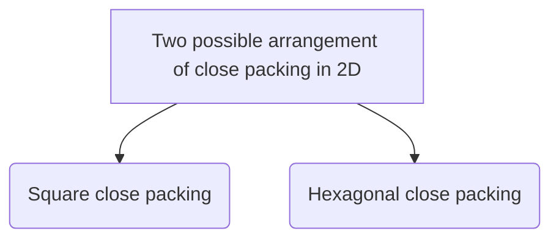
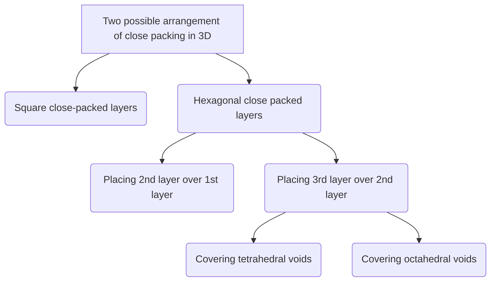

==Coordination number== = The number of spheres which are touching a given sphere.

## 1D

Each sphere is in contact with two other spheres, so <mark style="background: #FF5582A6;">coordination number is two.</mark> 
$CN=2$

## 2D

| Square close packing                                                                                                        | Hexagonal close packing                                                                            |
| --------------------------------------------------------------------------------------------------------------------------- | -------------------------------------------------------------------------------------------------- |
| The spheres in the adjacent row lie one over the other and show a horizontal as well as vertical alignment and form square. | The spheres in every second row are placed in the depression between the spheres of the first row. |
|                                                                                         |                                                                                                    |
| $CN=4$                                                                                                                      | $CN=6$                                                                                             |

## 3D

### 2D square close-packed layers 
#### Simple cubic lattice

> Second layer is placed exactly above the first layer of spheres.

<mark style="background: #FFB86CA6;">Arrangement</mark> : AAAA
<mark style="background: #FF5582A6;">Coordination number</mark> : 6
#### Body centered cubic close packing

> The spheres in the first layer are not touching each other and the second layer is placed at the voids of the first layer.
> <mark style="background: #BBFABBA6;">Third layer is placed exactly on first.</mark> 

<mark style="background: #FFB86CA6;">Arrangement</mark> : ABAB
<mark style="background: #FF5582A6;">Coordination number</mark> : 8
### 2D hexagonal close-packed layers 
##### Placing second layer over the first layer
The second layer is formed by placing the spheres in the voids of the first layer.

###### Placing sphere on tetrahedral voids 

- Tetrahedral void is covered.
- ABAB type of <mark style="background: #BBFABBA6;">arrangement</mark>.
- Hexagonal close packing(hcp)
This type of arrangement is found in metals like aluminium and zinc.
###### Placing sphere on Octahedral voids.

- Octahedral void is covered.
- ABCABC type of <mark style="background: #BBFABBA6;">arrangement</mark>.
- Cubic close packing/face-centered cubic arrangement.
This type of arrangement is found in metals like aluminium and zinc.
