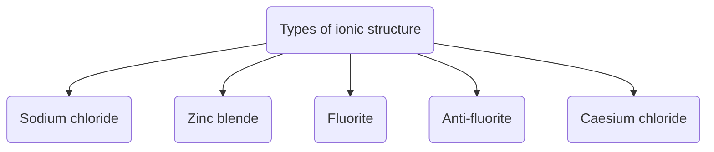

## Sodium Chloride (NaCl)

- $Cl^{-}=\text{fcc unit cell and }Na^{+}=\text{octahedral voids.}$
- C.N. of $Na^{+}=6, \text{C.N. of }Cl^{-}=6$
- Ratio of ionic radii = $\frac{r_{Na^{+}}}{r_{Cl^{-}}}=0.525$
- Number of $Na^{+}=12\times \frac{1}{4}+1\times 1=4$
- Number of $Cl^{-}=8\times \frac{1}{8}+6\times \frac{1}{2}=4$
- 