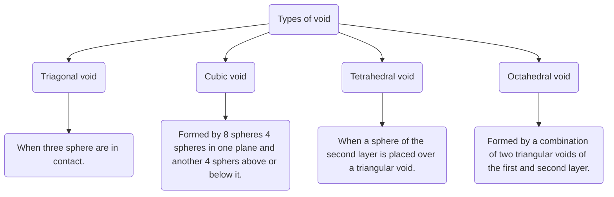

```mermaid
graph TD
A(Types of void)-->B(Triagonal void)
A-->C(Cubic void)
A-->D(Tetrahedral void)
A-->E(Octahedral void)
B-->F(When three sphere are in contact.)
C-->G(Formed by 8 spheres 4 spheres in one plane and another 4 sphers above or below it.)
D-->H(When a sphere of the second layer is placed over a triangular void.)
E-->I(Formed by a combination of two triangular voids of the first and second layer.)
```
