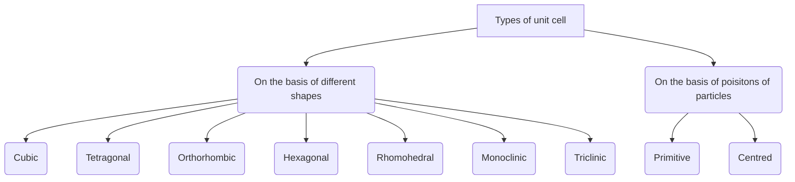
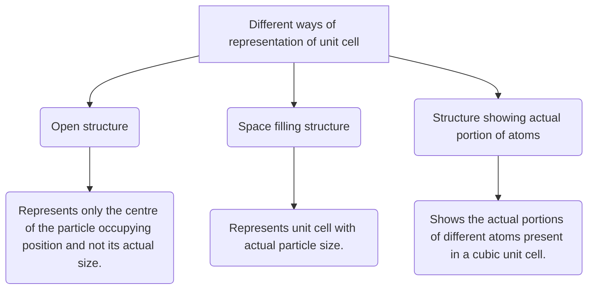

> Crystal lattice is a regular three dimensional arrangement of points in space.

# Unit Cell:
Unit cell is the smallest portion of a crystal lattice, which, when repeated in different directions, generates the entire lattice.
##### Characteristics 
- 3d
- Angles between the edges, $\alpha \text{(between b and c )}\beta \text{(between a and c and )} \gamma \text{(between a and b).}$
- 

| Name of system           | Axes            | Angles                                    |
| ------------------------ | --------------- | ----------------------------------------- |
| Cubic                    | a=b=c           | $\alpha=\beta=\gamma=90^{o}$              |
| Tetragonal               | a=b$\neq c$     | $\alpha=\beta=\gamma=90^{o}$              |
| Rhombohedral or Trigonal | a=b=c           | $\alpha=\beta=\gamma\neq90^{o}$           |
| Orthorhombic or Rhombic  | $a\neq b\neq c$ | $\alpha=\beta=\gamma=90^{o}$              |
| Monoclinic               | $a\neq b\neq c$ | $\alpha=\gamma=90^{o}, \, \beta\neq 90^o$ |
| Triclinic                | $a\neq b\neq c$ | $\alpha\neq\beta\neq\gamma\neq90^{o}$     |
| Hexagonal                | $a=b\neq c$     | $\alpha=\beta=90^{o} \,\, \gamma=120^o$   |

### Types of Cubic Unit Cell 
#### Simple cubic unit cell 
- Atoms only at its corner.
- Each atom at a corner is shared between eight adjacent unit cells.
- 
#### Body centered cubic unit cell 
- Atom at each of its corners and also one atom at its body centre 
- Atom at body centre wholly belongs to the unit cell in which it is present.
- 
#### Face centred cubic unit cell 
- Atoms at all the corners and at the cetnre of all the faces of the cube.
- Atom located at the face-centre is shared between two adjacent unit cells.
- 

#### End centred
Contains one constituent particle present at centre of any two opposite faces, besides the one present at its corners.

## Bravais lattice 

There are only 14 possible three dimensional lattices known as _Bravais lattices._

### Different ways of representation of unit cell:

### Rank of unit cell 
| Unit cell                | No. of atoms at corners | No. of atoms at faces | No. of atoms in centre | Total |     |
| ------------------------ | ----------------------- | --------------------- | ---------------------- | ----- | --- |
| Simple cubic             | $8\times \frac{1}{8}$   | 0                     | 0                      | 1     |
| Body Centred cubic (bcc) | $8 \times \frac{1}{8}$  | 0                     | 1                      | 2     | 
| Face Centred cubic (fcc) | $8 \times \frac{1}{8}$  | $6\times \frac{1}{2}$ | 0                      | 4     |

## Packing Efficiency
Packing efficiency is the percentage of total space filled by the particles.

$$\boxed{\text{Packing efficiency}=\frac{\text{Volume of one atom}}{\text{Volume of cubic unit cell}}\times100\%}$$
### For _simple cubic_ 
$\text{Packing efficiency}=\frac{\frac{4}{3}\pi r^{3}}{8r^{3}}\times 100$
$=\frac{\pi}{6}\times 100$
$=52.36\%=52.4\%$
### For _body centered cubic (bcc)_

Atoms present at the corner and center of body touch each other such that:
$\sqrt{3}a=4R$
$4=a \frac{\sqrt{3}}{4}$

$$\boxed{\text{Packing efficiency}=\frac{2\times(\frac{4}{3})\pi r^{3}\times 100}{[(4/\sqrt{3})r]^{3}}\%}=68\%$$
### For _Face centered cubic(fcc)_

In $\Delta ABC$,
$AC^{2}=b^{2}=BC^{2}+AB^{2}$
$=a^{2}+a^{2}$
$b=\sqrt{a}$
If r is the radius of the sphere, we find 
$b=4r=\sqrt{2}a$
or, $a=\frac{4r}{\sqrt{2}}=2 \sqrt{2}r$

$$\boxed{\text{Packing efficiency}=\frac{4\times(\frac{4}{3})\pi r^{3}\times 100}{[(2/\sqrt{2})r]^{3}}\%}=74\%$$

| Type of unit cell | Z   | _a & r_ relation        | Packing efficiency | Empty % |
| ----------------- | --- | ----------------------- | ------------------ | ------- |
| Simple cubic      | 1   | a=2r                    | 52.4%              | 47.6%   |
| BCC               | 2   | $a=\frac{4}{\sqrt{3}}r$ | 68%                | 32%     |
| FCC/CCP           | 4   | $a=2 \sqrt{2}r$         | 74%                | 26%     |

[[Density of unit cell(D)]]