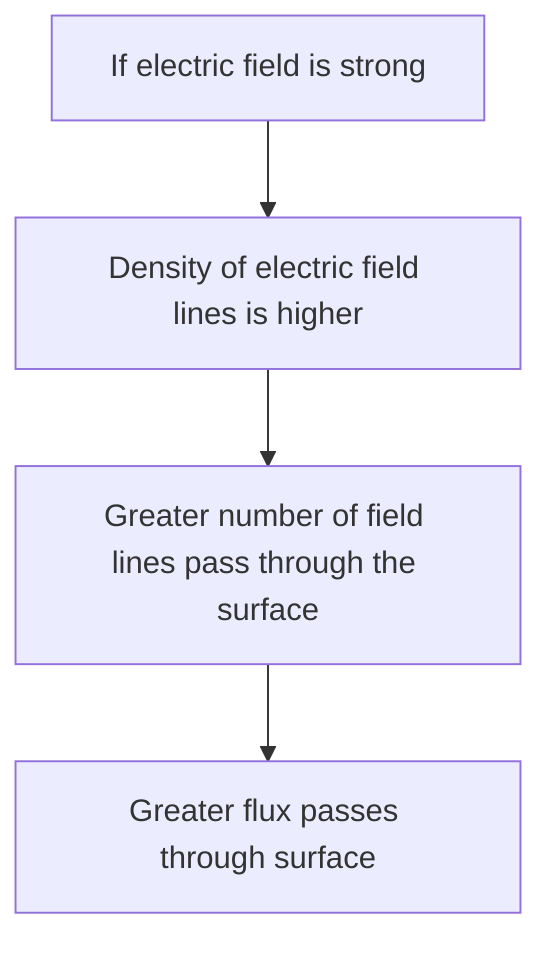
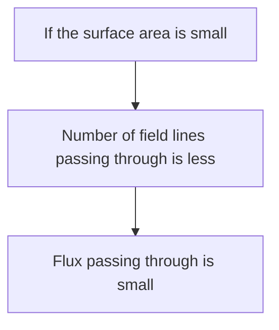
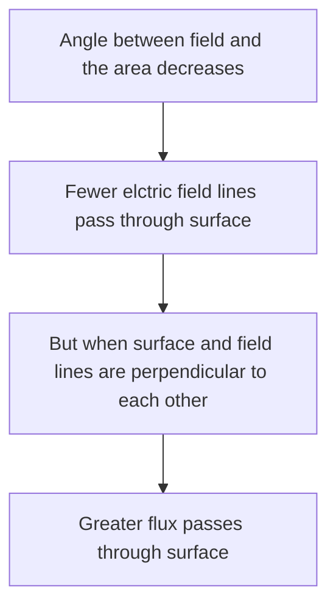

# Flux ($\phi$)
```ad-note 
title:Flux 
It is generally defined as number of something, crossing a surface.
```
- It is the measure of number of electric field lines passing through any surface.
- ==Scalar Quantity==
- SI unit: **V.M** Volt meters.

### What does flux depend upon?
![[Electric Flux 2022-05-05 13.27.54.excalidraw]]
#### [[Electric Field]] 

$$\boxed{\phi \propto E}$$
#### Surface Area 

$$\boxed{\phi \propto A}$$
#### Angle b/w electric field and area of surface 

$$\boxed{\phi \propto \theta}$$
